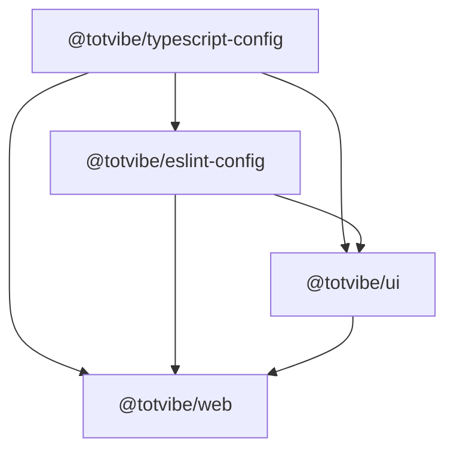
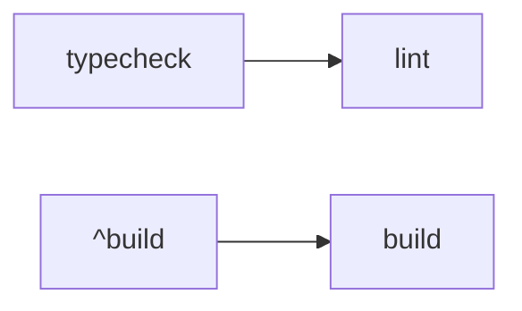

# Monorepo Setup

**Stack:** pnpm + Turbo + TypeScript + ESLint 9 (Flat Config)

## Package Structure



**Scope:** All packages use `@totvibe/*` (not `@repo/*`)

## TypeScript Configuration

### Shared Configs (`@totvibe/typescript-config`)

- `tsconfig.base.json` - Base with `module: NodeNext`, strict mode, composite
- `tsconfig.react.json` - React with `module: ESNext`, `moduleResolution: Bundler`
- `tsconfig.node.json` - Node.js with `allowImportingTsExtensions`, `noEmit`

### Strategy

- **Root** - Extends base, defines path aliases, project references
- **Web app** - Extends react for UI, base for config files (vite.config.ts, etc)
- **UI package** - Extends react
- **Config packages** - Extends node, disables composite/declaration for flexibility

## ESLint Configuration

### Architecture (Flat Config)

**Root `eslint.config.ts`** orchestrates all rules:

```typescript
[
  { ignores: [...] },

  // Base rules for all TS files
  ...baseConfig.map(config => ({
    ...config,
    files: ['**/*.ts', '**/*.tsx']
  })),

  // React rules only for React packages
  ...reactConfig.map(config => ({
    ...config,
    files: ['apps/web/**/*.{ts,tsx}', 'packages/ui/**/*.{ts,tsx}']
  })),

  // Exception: Allow comments in config packages
  {
    files: ['packages/eslint-config/**', 'packages/typescript-config/**'],
    rules: { 'custom/no-comments-except-pattern': 'off' }
  }
]
```

### Key Points

- **No package-level configs** - Single root config with file pattern filtering
- **Base config** (`@totvibe/eslint-config/eslint-base-config`) - TypeScript + Unicorn + Custom rules
- **React config** (`@totvibe/eslint-config/eslint-react-config`) - Extends base, adds React/hooks rules
- **Custom rules** - `no-comments-except-pattern`, `no-inferrable-return-type`

## Turbo Pipeline



### Task Configuration

```json
{
  "build": {
    "dependsOn": ["^build"],
    "outputs": ["dist/**", "build/**"],
    "inputs": ["src/**", "package.json", "tsconfig*.json", ...]
  },
  "typecheck": {
    "outputs": []  // No inputs = hash all files (safest)
  },
  "lint": {
    "dependsOn": ["typecheck"]  // No "^lint" - packages lint independently
  }
}
```

### Cache Strategy

- **`typecheck` & `lint`** - No `inputs` config = safest (hash everything)
- **`build`** - Explicit `inputs` for efficiency
- **`dev`** - `cache: false` (persistent task)

## Common Tasks

```bash
# Quality checks (show all errors with --continue)
pnpm typecheck         # Type check all packages
pnpm lint              # Lint all packages
pnpm typecheck --force # Bypass cache

# Development
pnpm dev               # Start all dev servers
pnpm build             # Build all packages

# Maintenance
pnpm clean             # Clean turbo cache + node_modules
pnpm bump              # Interactive dependency updates
```

## Design Decisions

### TypeScript

- **Module resolution:** `Bundler` for frontend (Vite), `NodeNext` for base
- **Strictness:** Maximum everywhere (`strict`, `noUncheckedIndexedAccess`, etc)
- **Project references:** Full composite setup for incremental builds
- **Config packages:** Disable composite to allow `as never` type assertions

### ESLint

- **Flat config only** - No legacy `.eslintrc`, no `includeIgnoreFile`
- **Root orchestration** - Single source of truth with pattern-based filtering
- **Independent linting** - No `^lint` dependency = all packages show errors

### Turbo

- **Build inputs** - Explicit for optimization
- **Check inputs** - Omitted for safety (no misconfiguration risk)
- **Continue on error** - Quality checks use `--continue` to show all errors
- **Dependency order** - Build uses `^build`, lint uses `typecheck` (not `^lint`)

## File Inventory

### Only 2 JavaScript Files (Rest is TypeScript)

- `prettier.config.js`
- `apps/web/postcss.config.js`

### Config Chain

```
Root tsconfig.json
  ↓ extends
@totvibe/typescript-config/tsconfig.base.json
  ↓ extended by
[tsconfig.react.json, tsconfig.node.json]
  ↓ extended by
package tsconfigs
```

## Troubleshooting

**Stale cache?**

```bash
pnpm typecheck --force  # Bypass cache
turbo daemon clean      # Clear daemon cache
```

**Lint not showing all errors?**

- Ensure `package.json` has `"lint": "turbo lint --continue"`
- Check no `^lint` in `turbo.json` (packages should lint independently)

**TypeScript resolution issues?**

- Check `@totvibe/typescript-config` exports in package.json
- Verify `allowImportingTsExtensions` for `.ts` imports
